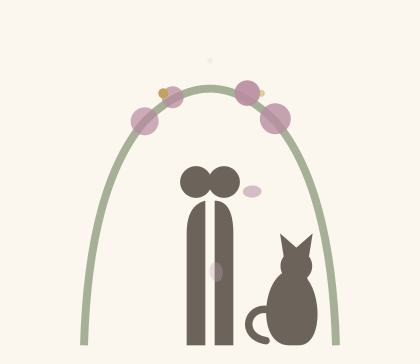

  

<h1 align="center">Esra &amp; Ömer</h1>

A personal wedding microsite — built for our own wedding day.

<a href="https://esraomer.com">esraomer.com</a>

---

Guests reach everything from one QR-linked hub: the invitation, a live memory
board, a shared photo &amp; video album, and a few light games.

**Built with** React + Vite + Tailwind CSS on the front end, a minimal Express
API on the back end, and S3 for media storage.
